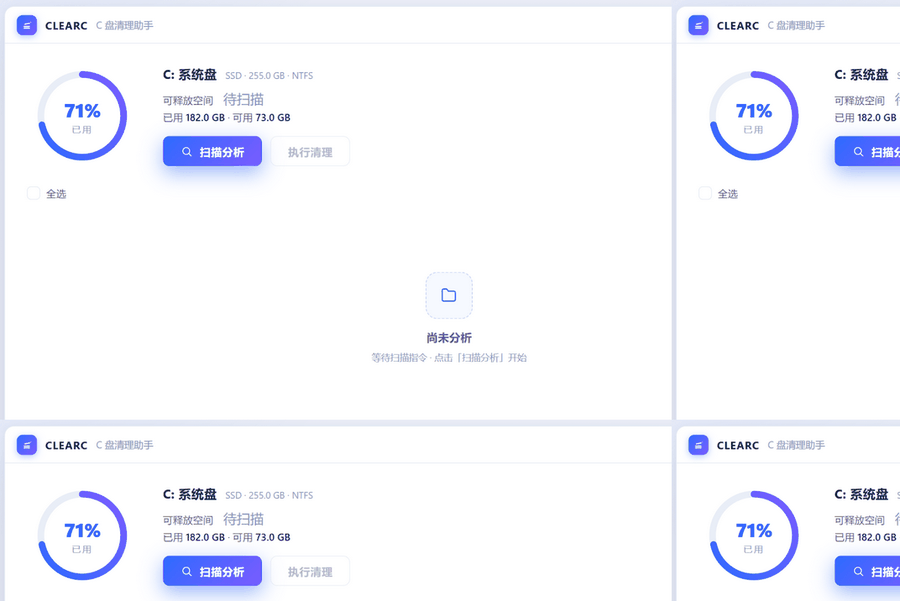

# ClearC

ClearC 是一个面向 Windows 的 C 盘空间分析与安全清理工具，使用 .NET 10、Avalonia 12、Semi.Avalonia 和 ReactiveUI 构建。

项目的重点不是“尽可能多删”，而是把每个清理目标的容量、风险、执行方式和失败原因展示清楚。低风险缓存默认选中；会造成不可恢复结果或需要重新下载依赖的项目必须手动选择并再次确认。



## 下载安装

从 [GitHub Releases](https://github.com/dotnet9/ClearC/releases/latest) 下载最新安装包（附 `.sha256` 校验）：


- Windows x64：`ClearC-v*-win-x64-setup.exe`（简体中文安装向导）

## 功能

- 浅色技术蓝紫界面：自绘标题栏、磁盘环图、分组清理列表、行内详情、风险确认、Toast、自绘日志面板与状态栏，共六个工作流状态。
- 清理目标已扩展到 113 个，覆盖系统缓存、系统日志与转储、升级与安装残留、遥测、显卡与游戏缓存、Store 应用、浏览器家族、开发缓存、引擎与移动开发、OEM 残留。
- 两档并行扫描：快档（缓存 / 日志 / 临时目录 / 单文件）4 路并发先出首屏结果，慢档（DISM、大树、Store 应用）2 路并发后台补齐；列表里只保留一条跟随当前分析目标的幽灵行（显示正在分析的真实路径或可读的分析项名称），已完成行按大小插入所属分组。
- 扫描走一次目录枚举取回类型、大小与写入时间（不再对每个条目额外查询属性），十万文件级的缓存目录实测快约 6 倍；每个目标独立超时（普通 60s、DISM/vssadmin 90s、大树 120s），DISM 与 vssadmin 串行执行避免互相锁死。
- 快速模式（默认开，分组栏右侧可切换）：跳过 `winsxs` 与 `vss-shadow` 这两个要拉起 DISM / `vssadmin` 子进程的分析项——未提权时它们拿不到官方数字却仍要等；取消勾选即恢复分析。未提权时 WinSxS 不再退化成整目录硬扫（未提权读不全、数字偏小且很慢），直接标注"需管理员"。
- 探测不到的目标不出现：npm / pnpm / yarn / pip / conda / Steam / Epic / GOG / Battle.net / Unity / Unreal / Android SDK 等按环境变量、注册表与 CLI 探测解析真实路径，详情里标注来源（注册表 / 环境变量 / CLI 探测 / 默认路径 / 目录探测）。
- 释放量分两种口径：官方命令清理只报估算值（`~` 前缀 + “（估算）”），目录与回收站清理报实测值，Toast 与行内详情分别显示。
- 未提权时顶部提示“未提权 · 部分系统缓存不可清理”并提供“以管理员重启”；需要管理员的项目显示“需管理员”且不可勾选。
- 关闭保护：扫描或清理中关闭窗口会弹出“取消 / 停止并退出”；重复启动时由单实例机制把已有窗口带到前台。
- 分类列表按“临时文件 / 系统缓存 / 回收站 / 浏览器 / 用户文件 / 系统文件”六组展示，默认隐藏 0 字节项；六组默认全部折叠（组头已给出项数与小计），点开一组时其余自动折叠，首屏保持清爽。
- Codex 会话记录默认不选；用户主动勾选且 Codex 已关闭时，仅清理 `sessions` 与 `archived_sessions`。
- 清理 NuGet 全局包前检查已加载的缓存 DLL，发现 IDE/MSBuild 占用时整项跳过。
- 临时文件仅清理超过 7 天未修改的文件；占用或无权限文件会跳过并记录。
- 日志在写入 `%LocalAppData%\ClearC\Logs` 与日志面板前统一脱敏（用户目录、`%APPDATA%`、`%LOCALAPPDATA%`、`%TEMP%`、`%ProgramData%`、`C:\Windows` 前缀替换为环境变量占位符），面板支持复制全部 / 导出 / 清空。
- 行详情可一键“打开位置”，在资源管理器中定位该清理路径（路径已失效时在详情里说明原因）；`Esc` 关闭当前模态（确认页回到结果页，关闭保护直接收起）。

## 安全边界

风险列：`低` = 默认勾选；`中` = 默认不勾、需确认；`-` = 仅分析。档列：`快` = 快档；`慢` = 慢档。管理员列：`是` = 未提权时不可清理。

### G1 Windows 系统缓存

| 目标 | 路径 | 执行 | 风险 | 档 | 管理员 |
| --- | --- | --- | --- | --- | --- |
| win-temp | `C:\Windows\Temp` | 目录内容（>7 天） | 低 | 快 | 是 |
| wu-download | `C:\Windows\SoftwareDistribution\Download` | 目录内容 | 低 | 快 | 是 |
| delivery-optimization | `C:\ProgramData\Microsoft\Windows\DeliveryOptimization\Cache` | 目录内容 | 低 | 快 | 是 |
| prefetch | `C:\Windows\Prefetch` | 目录内容 | 中 | 快 | 是 |
| thumbnail-icon-cache | `%LocalAppData%\Microsoft\Windows\Explorer` | 文件模式 `thumbcache_*.db` `iconcache_*.db` | 低 | 快 | 否 |

### G2 Windows 日志与转储

| 目标 | 路径 | 执行 | 风险 | 档 | 管理员 |
| --- | --- | --- | --- | --- | --- |
| wer-archive | `%ProgramData%\Microsoft\Windows\WER`（ReportQueue/ReportArchive） | 目录内容 | 低 | 快 | 是 |
| wer-user | `%LocalAppData%\Microsoft\Windows\WER` | 目录内容 | 低 | 快 | 否 |
| crash-dumps | `%LocalAppData%\CrashDumps` | 目录内容 | 低 | 快 | 否 |
| minidump | `C:\Windows\Minidump` | 目录内容 | 低 | 快 | 是 |
| live-kernel-reports | `C:\Windows\LiveKernelReports` | 目录内容 | 低 | 快 | 是 |
| windows-panther | `C:\Windows\Panther` | 目录内容 | 低 | 快 | 是 |
| windows-logs | `C:\Windows\Logs`（排除 `CBS`，见 G12） | 目录内容 | 低 | 快 | 是 |
| perf-logs | `C:\PerfLogs` | 目录内容 | 低 | 快 | 是 |
| wmi-rtbackup | `C:\Windows\System32\LogFiles\WMI\RtBackup` | 目录内容（WMI 占用时跳过） | 低 | 快 | 是 |

### G3 升级与安装残留

| 目标 | 路径 | 执行 | 风险 | 档 | 管理员 |
| --- | --- | --- | --- | --- | --- |
| upgrade-bt | `C:\$WINDOWS.~BT` | 目录内容 | 中（删后无法回滚升级） | 慢 | 是 |
| upgrade-ws | `C:\$WINDOWS.~WS` | 目录内容 | 中 | 慢 | 是 |
| get-current | `C:\$GetCurrent` | 目录内容 | 低 | 快 | 是 |
| esd | `C:\ESD` | 目录内容 | 中 | 慢 | 是 |
| win-system-temp | `C:\Windows\SystemTemp`（Win11 24H2+） | 目录内容 | 低 | 快 | 是 |
| retail-demo | `C:\ProgramData\Microsoft\Windows\RetailDemo` | 目录内容 | 低 | 快 | 是 |
| downloaded-program-files | `C:\Windows\Downloaded Program Files` | 目录内容 | 低 | 快 | 是 |
| winre-agent | `C:\$WinREAgent` | 仅分析 | - | 快 | 是 |

### G4 遥测与 Defender

| 目标 | 路径 | 执行 | 风险 | 档 | 管理员 |
| --- | --- | --- | --- | --- | --- |
| diagnosis | `C:\ProgramData\Microsoft\Diagnosis` | 目录内容 | 低 | 慢 | 是 |
| uso-shared | `C:\ProgramData\Microsoft\USOShared` | 目录内容 | 低 | 快 | 是 |
| uso-private | `C:\ProgramData\Microsoft\USOPrivate` | 目录内容 | 低 | 快 | 是 |
| defender-history | `C:\ProgramData\Microsoft\Windows Defender\Scans\History` | 仅分析（Tamper Protection 会拒删） | - | 快 | 是 |

### G5 显卡与游戏

| 目标 | 路径 | 执行 | 风险 | 档 | 管理员 |
| --- | --- | --- | --- | --- | --- |
| nvidia-shader-user | `%LocalAppData%\NVIDIA\DXCache`、`GLCache` | 目录内容 | 低 | 快 | 否 |
| nvidia-nv-cache | `C:\ProgramData\NVIDIA Corporation\NV_Cache` | 目录内容 | 低 | 快 | 是 |
| amd-shader | `%LocalAppData%\AMD\DxCache`、`GLCache` | 目录内容 | 低 | 快 | 否 |
| intel-shader | `%LocalAppData%\Intel\ShaderCache` | 目录内容 | 低 | 快 | 否 |
| d3d-shader-cache | `%LocalAppData%\D3DSCache` | 目录内容 | 低 | 快 | 否 |
| steam-shadercache | `<Steam>\steamapps\shadercache` | 目录内容 | 低 | 慢 | 否 |
| steam-depot-appcache | `<Steam>\steamapps\depotcache`、`<Steam>\appcache`、`%LocalAppData%\Steam\htmlcache` | 目录内容 | 低 | 慢 | 否 |
| epic-webcache | `%LocalAppData%\EpicGamesLauncher\Saved\webcache*` | 目录内容 | 低 | 快 | 否 |
| gog-battlenet-cache | 探测（GOG Galaxy / Battle.net 缓存） | 目录内容 | 低 | 快 | 否 |

### G6 Store 应用与 Game Bar

| 目标 | 路径 | 执行 | 风险 | 档 | 管理员 |
| --- | --- | --- | --- | --- | --- |
| store-tempstate | `%LocalAppData%\Packages\*\TempState` | 目录内容 | 低 | 慢 | 否 |
| store-ac-temp | `%LocalAppData%\Packages\*\AC\Temp` | 目录内容 | 低 | 慢 | 否 |
| store-localcache | `%LocalAppData%\Packages\*\LocalCache` | 目录内容 | 中（个别应用把数据放这里） | 慢 | 否 |

### G7 浏览器家族

| 目标 | 路径 | 执行 | 风险 | 档 | 管理员 |
| --- | --- | --- | --- | --- | --- |
| browser-cache | Edge/Chrome 增加 `DawnCache`、`DawnGraphiteCache`、`Media Cache`、`component_crx_cache` | 目录内容 | 低 | 快 | 否 |
| firefox-cache | `%LocalAppData%\Mozilla\Firefox\Profiles\*\`：`cache2`、`startupCache`、`shader-cache` | 目录内容 | 低 | 快 | 否 |
| webview2-cache | `%LocalAppData%\Microsoft\EdgeWebView\*\`：`Cache`、`Code Cache`、`GPUCache`、`DawnCache` | 目录内容 | 低 | 快 | 否 |
| chromium-family-cache | Brave / Vivaldi / Opera 同构目录 | 目录内容 | 低 | 快 | 否 |
| cn-browser-cache | 360 / QQ / 搜狗（待真机确认，探测不到不显示） | 目录内容 | 低 | 快 | 否 |
| inetcache | `%LocalAppData%\Microsoft\Windows\INetCache` | 目录内容（不含 Cookie / 历史记录） | 低 | 慢 | 否 |

### G8 开发缓存补充

| 目标 | 路径 | 执行 | 风险 | 档 | 管理员 |
| --- | --- | --- | --- | --- | --- |
| huggingface-cache | `%USERPROFILE%\.cache\huggingface` | 目录内容 | 中 | 慢 | 否 |
| torch-cache | `%USERPROFILE%\.cache\torch` | 目录内容 | 中 | 慢 | 否 |
| conda-pkgs | `%USERPROFILE%\.conda\pkgs` + `<anaconda>\pkgs`（探测） | 目录内容 | 中 | 慢 | 否 |
| composer-cache | `%LocalAppData%\Composer\cache`、`%APPDATA%\Composer\cache` | 目录内容 | 低 | 快 | 否 |
| chocolatey-temp | `C:\ProgramData\chocolatey\logs`、`lib-bad`、`%TEMP%\chocolatey` | 目录内容 | 低 | 快 | 是 |
| scoop-cache | `<scoop>\cache`（探测，默认 `%USERPROFILE%\scoop\cache`） | 目录内容 | 低 | 快 | 否 |
| winget-localstate | `%LocalAppData%\Packages\Microsoft.DesktopAppInstaller_8wekyb3d8bbwe\LocalState` | 目录内容 | 低 | 快 | 否 |
| vcpkg-downloads | `<vcpkg>\downloads`、`buildtrees`（探测） | 目录内容 | 中 | 慢 | 否 |
| msys2-pacman-cache | `<msys2>\var\cache\pacman\pkg`（探测） | 目录内容 | 低 | 慢 | 否 |

### G9 引擎与移动开发

| 目标 | 路径 | 执行 | 风险 | 档 | 管理员 |
| --- | --- | --- | --- | --- | --- |
| unity-cache | `%LocalAppData%\Unity\cache` | 目录内容 | 低 | 慢 | 否 |
| unreal-ddc | `%LocalAppData%\UnrealEngine\Common\DerivedDataCache` | 目录内容 | 低 | 慢 | 否 |
| android-sdk-temp | `%LocalAppData%\Android\Sdk\.temp` | 目录内容 | 低 | 快 | 否 |
| android-avd | `%USERPROFILE%\.android\avd` | 仅分析 | - | 慢 | 否 |
| rustup-toolchains | `%USERPROFILE%\.rustup\toolchains` | 仅分析 | - | 慢 | 否 |

### G10 Electron 与桌面应用

| 目标 | 路径 | 执行 | 风险 | 档 | 管理员 |
| --- | --- | --- | --- | --- | --- |
| discord-cache | `%APPDATA%\discord\`：`Cache`、`Code Cache`、`GPUCache` | 目录内容 | 低 | 快 | 否 |
| slack-cache | `%APPDATA%\Slack\` 同构目录 | 目录内容 | 低 | 快 | 否 |
| teams-classic-cache | `%APPDATA%\Microsoft\Teams\` 同构目录 | 目录内容 | 低 | 快 | 否 |
| teams-new-cache | `%LocalAppData%\Packages\MSTeams_*\LocalCache` | 目录内容 | 低 | 慢 | 否 |
| office-file-cache | `%LocalAppData%\Microsoft\Office\16.0\OfficeFileCache` | 目录内容 | 低 | 快 | 否 |
| onedrive-logs | `%LocalAppData%\Microsoft\OneDrive\logs`、`setup\logs` | 目录内容 | 低 | 快 | 否 |
| rdp-cache | `%LocalAppData%\Microsoft\Terminal Server Client\Cache` | 目录内容 | 低 | 快 | 否 |
| signal-cache | `%APPDATA%\Signal\`：`Cache`、`Code Cache`、`GPUCache` 等 | 目录内容 | 低 | 快 | 否 |
| whatsapp-cache | `%APPDATA%\WhatsApp\` 同构缓存目录 | 目录内容 | 低 | 快 | 否 |
| notion-cache | `%APPDATA%\Notion\` 同构缓存目录 | 目录内容 | 低 | 快 | 否 |
| postman-cache | `%APPDATA%\Postman\` 同构缓存目录 | 目录内容 | 低 | 快 | 否 |
| figma-cache | `%APPDATA%\Figma\` 同构缓存目录 | 目录内容 | 低 | 快 | 否 |
| obsidian-cache | `%APPDATA%\obsidian\` 同构缓存目录 | 目录内容 | 低 | 快 | 否 |
| cursor-cache | `%APPDATA%\Cursor\` 同构缓存目录 | 目录内容 | 低 | 快 | 否 |

上表最后 7 项是 Electron 应用（含 VS Code 分支）的 Chromium 缓存，路径按 `<userData>\Cache|Code Cache|GPUCache|DawnCache|…` 约定生成，命中才显示；不触碰聊天记录、工作区、笔记库与设置。

### G11 OEM / 驱动安装残留（全部仅分析）

`C:\Intel`、`C:\AMD`、`C:\NVIDIA`、`C:\SWSetup`、`C:\inetpub\logs`。

### G12 系统分析档（有代价，仅分析）

| 目标 | 来源 | 说明 |
| --- | --- | --- |
| winsxs | `dism /Online /Cleanup-Image /AnalyzeComponentStore` | 提权时用官方数字；未提权或分析失败回退目录扫描，数字含硬链接、偏大 |
| windows-installer | `C:\Windows\Installer` | 删后无法修复/卸载 |
| package-cache | `C:\ProgramData\Package Cache` | VS/MSI 安装源 |
| search-index | `C:\ProgramData\Microsoft\Search\Data` | Windows.edb |
| font-cache | `C:\Windows\ServiceProfiles\LocalService\AppData\Local\FontCache` | 需停 FontCache 服务 |
| vss-shadow | `vssadmin list shadowstorage` | 系统还原点/卷影副本 |
| cbs-logs | `C:\Windows\Logs\CBS` | 服务日志 |
| etl-logs | `C:\Windows\System32\LogFiles\**\*.etl` | 总量 |
| wsl-docker-vhdx | `%LocalAppData%\Packages\*\LocalState\ext4.vhdx`、`%LocalAppData%\Docker\wsl\*\data\ext4.vhdx` | 只查文件大小，不调 `wsl.exe` |
| swapfile | `C:\swapfile.sys` | 与 pagefile 同族，补齐 |
| windows-old / hiberfil / pagefile / memory-dump | 现状保留 | 现状 |

### G13 现有开发缓存（保留 + 补齐）

| 目标 | 路径 | 执行 | 风险 | 档 | 管理员 |
| --- | --- | --- | --- | --- | --- |
| nuget-global | `%USERPROFILE%\.nuget\packages`（探测：`NUGET_PACKAGES` / `NuGet.Config`） | `dotnet nuget locals global-packages --clear` | 中（检测 DLL 占用） | 快 | 否 |
| nuget-http | `%LocalAppData%\NuGet\v3-cache` | `dotnet nuget locals http-cache --clear` | 低 | 快 | 否 |
| nuget-temp | `%TEMP%\NuGetScratch` | `dotnet nuget locals temp --clear` | 低 | 快 | 否 |
| nuget-plugins | `%LocalAppData%\NuGet\plugins-cache` | `dotnet nuget locals plugins-cache --clear` | 低 | 快 | 否 |
| user-temp | `%TEMP%` | 白名单目录内逐文件清理（>7 天） | 低 | 快 | 否 |
| npm-cache | 探测（默认 `%LocalAppData%\npm-cache`） | `npm cache clean --force` | 低 | 快 | 否 |
| pnpm-store | 探测（`PNPM_HOME\store`） | `pnpm store prune` | 中 | 快 | 否 |
| yarn-cache | 探测（`YARN_CACHE_FOLDER` 或 `%LocalAppData%\Yarn\Cache`） | `yarn cache clean` | 低 | 快 | 否 |
| pip-cache | 探测（`PIP_CACHE_DIR` 或 `%LocalAppData%\pip\Cache`） | 目录内容 | 低 | 快 | 否 |
| uv-cache | 探测（`UV_CACHE_DIR` 或 `%LocalAppData%\uv\cache`） | 目录内容 | 低 | 快 | 否 |
| cargo-registry | 探测（`CARGO_HOME\registry\cache` 或 `%USERPROFILE%\.cargo\registry\cache`） | 目录内容 | 中 | 慢 | 否 |
| go-modcache | 探测（`GOMODCACHE` 或 `%USERPROFILE%\go\pkg\mod`） | 目录内容 | 中 | 慢 | 否 |
| gradle-caches | 探测（`GRADLE_USER_HOME\caches` 或 `%USERPROFILE%\.gradle\caches`） | 目录内容 | 中 | 慢 | 否 |
| maven-repository | 探测（`MAVEN_REPO_LOCAL` 或 `%USERPROFILE%\.m2\repository`） | 目录内容 | 中 | 慢 | 否 |
| vscode-cache | `%APPDATA%\Code\Cache`、`CachedData`、`logs` | 目录内容（不含设置与扩展本身） | 低 | 快 | 否 |
| jetbrains-caches | `%LocalAppData%\JetBrains\*\caches`（目录探测） | 目录内容 | 中 | 慢 | 否 |
| codex-data | `%USERPROFILE%\.codex\sessions`、`archived_sessions` | ClearC 本地清理固定目录 | 高（Codex 运行时整项跳过） | 快 | 否 |
| recycle-bin | `C:\$Recycle.Bin` | Windows Shell API | 中（清空后不可恢复） | 快 | 否 |

### 仅分析（不提供清理入口）

G11 全部目标、G12 全部目标、`android-avd`、`rustup-toolchains`、`winre-agent`、`defender-history` 只显示占用数字。WinSxS 与卷影副本只解析 DISM / `vssadmin` 的官方数字；这两项默认被"快速模式"跳过，需要数字时在分组栏取消勾选（未提权时两者都只显示"需管理员"）。

### 明确不碰

- 隐私与登录数据：Cookie/登录态、`IndexedDB`、`Local Storage`、浏览历史、`%APPDATA%\Microsoft\Windows\Recent`、Jump List、剪贴板历史。
- iPhone 备份（`Apple Computer\MobileSync\Backup`）、微信/QQ 聊天记录。
- `.codex` 下除 `sessions` / `archived_sessions` 以外的任何数据；用户文档、下载、桌面、源码仓库。
- 其他磁盘卷（`D:\` 等）的分析与清理；本版本只处理系统盘。
- WinSxS、`Windows\Installer`、`Package Cache`、搜索索引、还原点的实际清理（只显示数字）。
- 不提供“移到回收站”作为删除方式，删除一律是永久删除。

ClearC 不会自动结束 IDE、`dotnet`、MSBuild 或浏览器进程。遇到占用时应关闭相关程序后重新扫描。

### 待真机确认

`cn-browser-cache`（360 / QQ / 搜狗）与 `gog-battlenet-cache` 按候选路径探测，命中才显示；在真机核对前不写入正式支持列表。

## 环境

- Windows 10/11 x64
- [.NET 10 SDK](https://dotnet.microsoft.com/download/dotnet/10.0)（从源码构建时需要）

仓库通过 `global.json` 固定 SDK 功能带，并允许使用同一功能带的最新补丁。

`net10.0`（非 Windows）目标仅用于编译验证：程序在非 Windows 平台启动时会打印“ClearC 目前仅支持 Windows”并以退出码 2 结束，不进入 Avalonia 生命周期。

## 构建和运行

```powershell
dotnet restore ClearC.slnx
dotnet build ClearC.slnx
dotnet run --project src/ClearC.Desktop/ClearC.Desktop.csproj
```

`ClearC.Desktop.exe --selfcheck` 会在初始化 Avalonia、构建主窗口视图模型、解析主题资源并跑一次目录大小计算后退出，用于 AOT 产物的冒烟验证（`scripts/smoke.ps1` 即调用它）。

## 测试

```powershell
dotnet test tests/ClearC.Core.Tests/ClearC.Core.Tests.csproj
dotnet test tests/ClearC.Desktop.Tests/ClearC.Desktop.Tests.csproj
```

测试覆盖容量格式化、选择与风险策略、目录扫描、受保护清理、目标清单断言（id 唯一、路径绝对且不含 `..`、仅分析项无清理器、清理白名单不含通配符）、路径探测、清理器与探测器注册表、DISM/vssadmin 输出解析、缓存锁检测、提权与平台守卫、日志脱敏、六态工作流和 Avalonia 无窗口渲染。

## 发布

执行：

```bat
publish_win-x64.bat --no-pause
```

通用入口支持一次发布一个或多个平台：

```bat
publish.bat "win-x64" --no-pause
publish_all.bat --no-pause
```

`publish_all.bat` 默认只发布 `win-x64`；Linux RID 需要在 `publish.bat` 里显式指定，且只用于验证编译通过。

自包含程序输出到：

```text
artifacts\publish\win-x64\ClearC\ClearC.Desktop.exe
```

目标机器不需要预装 .NET Runtime。Windows x64 发布生成 NativeAOT、裁剪后的自包含程序；Linux x64/arm64 发布生成裁剪后的单文件程序。所有平台都会剥离 PDB/XML 符号文件。

发布时可通过 `-Version` 把版本号写入程序集元数据（`scripts/publish.ps1 -RuntimeIdentifiers win-x64 -Version 0.2.0`）。

### 安装包与自动发布

推送 `v*` 或纯数字标签（例如 `v0.2.0` 或 `0.2.0`）会触发 [.github/workflows/release.yml](.github/workflows/release.yml)：

1. 跑一遍全部测试；
2. 为 win-x64 / linux-x64 / linux-arm64 / osx-x64 / osx-arm64 五个平台发布并执行 `--selfcheck` 冒烟验证；
3. 分别生成 Windows 安装包（Inno Setup 中文向导 `ClearC-v0.2.0-win-x64-setup.exe`）、Linux `.deb` 与 macOS `.dmg`，均附 `.sha256` 校验文件；
4. 创建 GitHub Release 并附上全部安装包。

也可以在 GitHub Actions 页面手动触发 `release` 工作流并输入版本号。若仓库中存在 `.github/release-notes/v0.2.0.md`，Release 正文会使用它，否则自动生成变更说明。

本机构建安装包（需安装 [Inno Setup 6](https://jrsoftware.org/isinfo.php)）：

```powershell
./scripts/build_installer.ps1 -Version 0.2.0              # x64
```

输出到 `artifacts\release\`。ClearC 的清理功能仅支持 Windows（非 Windows 平台启动会提示并退出）；自动发布除 Windows 安装包外，也会为 Linux/macOS 生成 deb/dmg 安装包。

## 日志与隐私

日志写入 `%LocalAppData%\ClearC\Logs`，新写入的日志会把 `%USERPROFILE%` / `%APPDATA%` / `%LOCALAPPDATA%` / `%TEMP%` / `%ProgramData%` / `C:\Windows` 前缀替换为环境变量占位符，日志面板的复制与导出同样使用脱敏后的内容。

脱敏只对新写入生效：**0.1.0 及更早版本留下的日志文件可能包含真实用户名与路径**，不迁移也不重写，可手动删除 `%LocalAppData%\ClearC\Logs` 下的历史文件。

## 项目结构

```text
src/ClearC.Core/          清理模型、选择规则、安全策略与接口
src/ClearC.Desktop/       Avalonia UI、目标清单、路径探测、Windows 扫描和清理实现
tests/                    核心测试、Windows 适配器测试和无窗口 UI 测试
design/                   六个状态的 HTML/CSS/JS 视觉原型
scripts/                  可重复执行的发布脚本与冒烟脚本
```

## 贡献

提交改动前请阅读 [CONTRIBUTING.md](CONTRIBUTING.md)。安全问题请按 [SECURITY.md](SECURITY.md) 私下报告，不要公开包含敏感路径或个人数据的日志。

## 许可证

[MIT](LICENSE)

## 发布

标准发布流程与发布说明规范见 [docs/RELEASE.md](docs/RELEASE.md)。
